# hubmi.pl — Małopolski Hub Innowacji Społecznych

Mieszkaniec opisuje problem albo pomysł zwykłymi słowami, a asystent AI zamienia to w uporządkowane
zgłoszenie i od razu podpowiada sprawdzone innowacje z biblioteki ROPS. Instytucja dostaje gotowe
zgłoszenia z oceną ryzyka, dopasowaniami i mapą potrzeb regionu.

Prototyp przygotowany na HackYeah dla **Regionalnego Ośrodka Polityki Społecznej w Krakowie**.

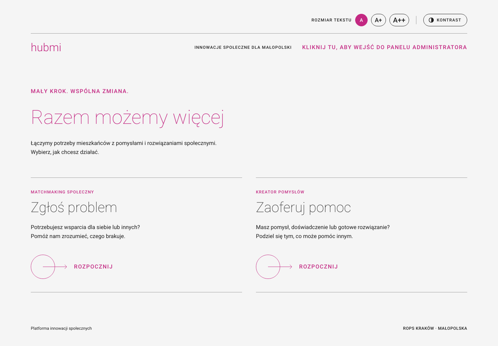

## Wynik na HackYeah 2026

Zespół **JSON Derulo** ze Szczecina, zadanie partnerskie **[UMWM]: HubMi.pl**. Do finałowych pitchy się nie
dostaliśmy, ale średnia ocen jury była wyraźnie wyższa niż średnia wszystkich drużyn.

| Kryterium (waga) | Ocena |
| --- | ---: |
| Stopień spełnienia wyzwania (40%) | 7,50 |
| Potencjał wdrożeniowy (20%) | 7,00 |
| Dostępność i intuicyjność prototypu (20%) | 7,50 |
| Atrakcyjność, pomysłowość i jakość interfejsu (10%) | 7,00 |
| Jakość dostarczonych materiałów oraz MVP (10%) | 7,50 |
| **Średnia ważona** | **7,35** |
| Średnia wszystkich drużyn | 5,57 |

## Demo w minutę

Nigdzie nie trzeba się logować, również do Panelu Administratora.

1. **`/zglos-problem`**: napisz jedno zdanie o problemie, np. *„Sąsiad z demencją od trzech dni nie
   otwiera drzwi”*. Asystent dopyta o szczegóły, pokaże pasujące innowacje i przygotuje zgłoszenie.
2. **`/zaoferuj-pomoc`**: opisz pomysł. Obok rozmowy wypełnia się fiszka pomysłu. Potem przejdź
   do kanwy innowacji i wniosku o dofinansowanie, który pisze AI.
3. **`/admin`**: zobacz, jak to samo zgłoszenie wygląda po stronie instytucji: podsumowanie AI,
   kategoria, poziom ryzyka, lokalizacja na mapie i trzy najbliższe innowacje.

## Jak to działa

```text
 Mieszkaniec                         hubmi.pl                                Instytucja (ROPS)
 ───────────                         ────────                                ─────────────────
 „Zgłoś problem”    ──► czat AI (SSE) ──► RAG po bibliotece innowacji ──►  Zgłoszenia + ryzyko
 „Zaoferuj pomoc”   ──► fiszka ──► kanwa ──► wniosek w naborze        ──►  Inicjatywy i nabory
                               │
                               └─► enrichment: tytuł, podsumowanie, kategoria,
                                   grupa docelowa, embedding ──► dopasowania ──►  Mapa potrzeb, raporty
```

- **Rozmowa**: OpenAI Responses API, odpowiedzi strumieniowane przez SSE. Asystent ma dwa tryby:
  problem i oferta pomocy. W trakcie rozmowy szuka podobnych rozwiązań w bazie innowacji ROPS.
- **Enrichment**: każde zgłoszenie dostaje od AI tytuł, podsumowanie, jedną z 14 kategorii, grupę
  docelową, poziom ryzyka i embedding.
- **Matchmaking**: dla każdego zgłoszenia system wybiera 3 najbliższe *opublikowane* innowacje
  Te same pary liczą się w obie strony, więc licznik
  „pasuje do N zgłoszeń” przy innowacji zgadza się z dopasowaniami w zgłoszeniach.
- **Dostępność**: WCAG 2.1 AA. Belka dostępności pozwala powiększyć tekst (A / A+ / A++) i włączyć
  wysoki kontrast; ustawienia zostają zapamiętane w przeglądarce.

## Widoki

### Dla mieszkańców

| | |
| --- | --- |
| 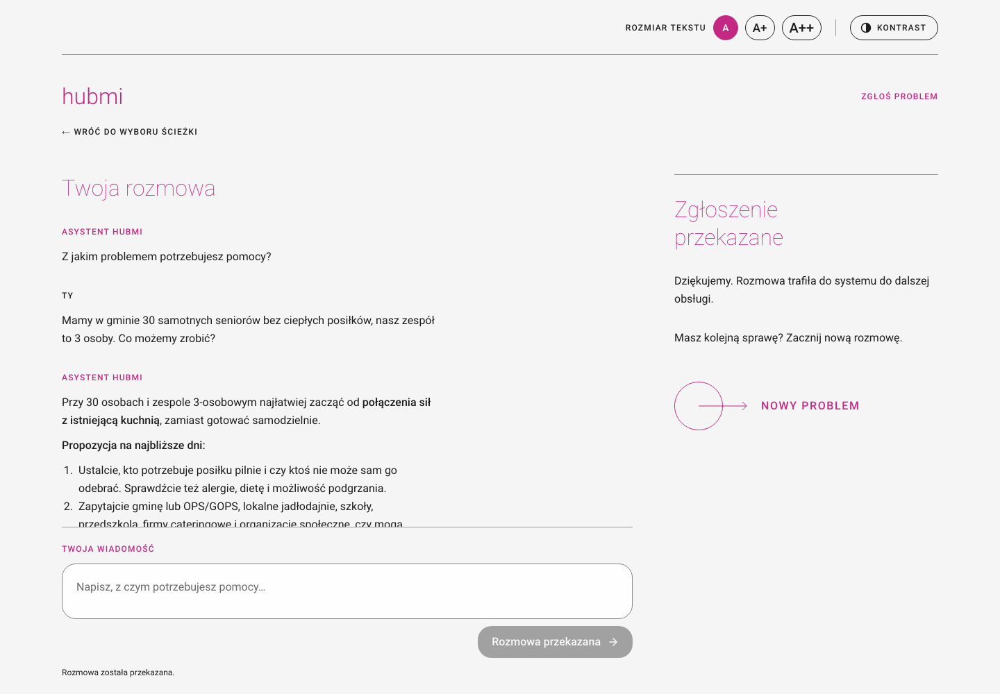 | 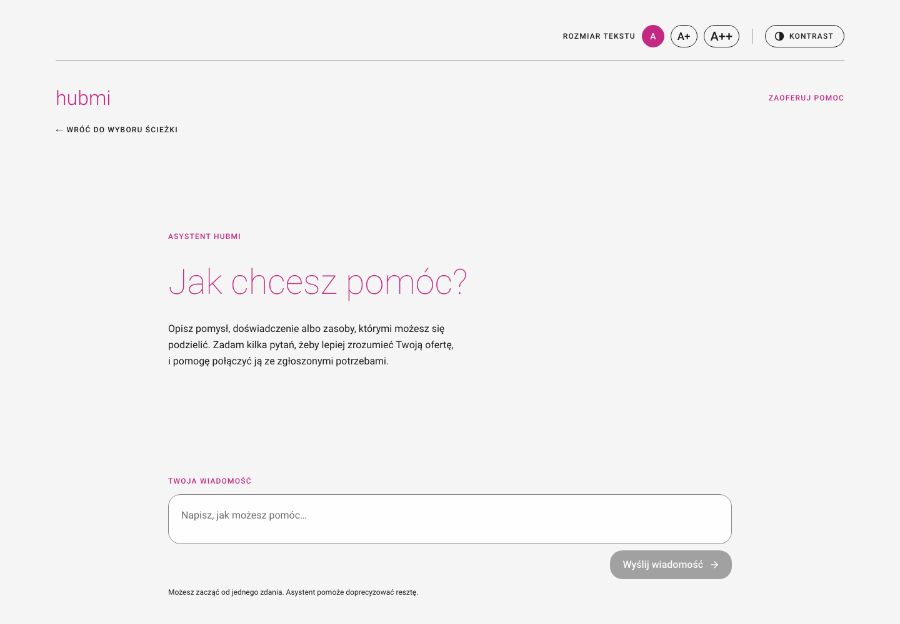 |
| **Zgłoś problem**: rozmowa kończy się zgłoszeniem, które mieszkaniec potwierdza. Przy zagrożeniu życia asystent najpierw kieruje pod 112. | **Zaoferuj pomoc**: rozmowa o pomyśle, z fiszką uzupełnianą na bieżąco. |
| 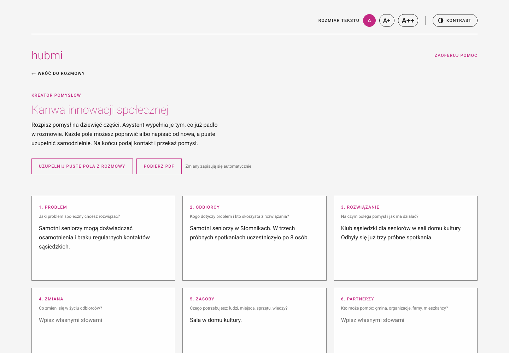 | 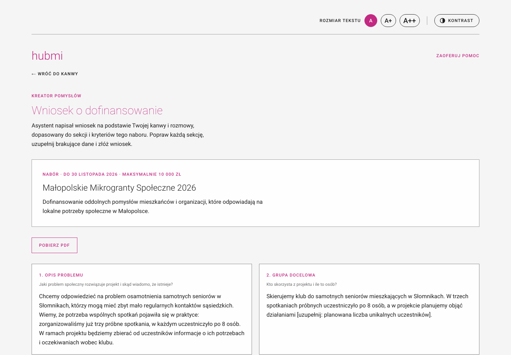 |
| **Kanwa innowacji**: 9 pól wstępnie wypełnionych z rozmowy, zapis automatyczny, eksport do PDF. | **Wniosek o dofinansowanie**: AI pisze go z kanwy pod sekcje i kryteria konkretnego naboru. |
| 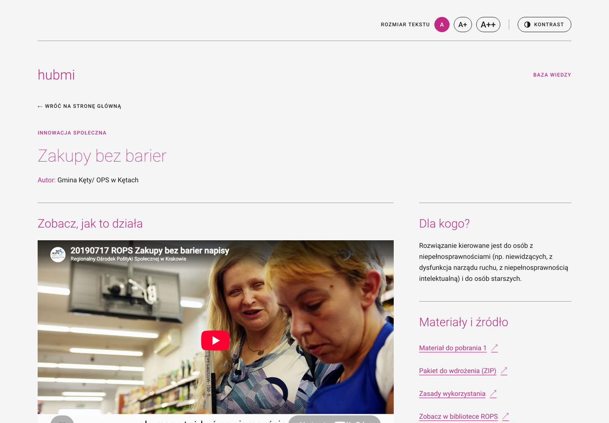 | |
| **Strona innowacji**: opis, grupa docelowa, materiały do wdrożenia, komentarze i zapis na testera. | |

### Panel Administratora (`/admin`)

| | |
| --- | --- |
| 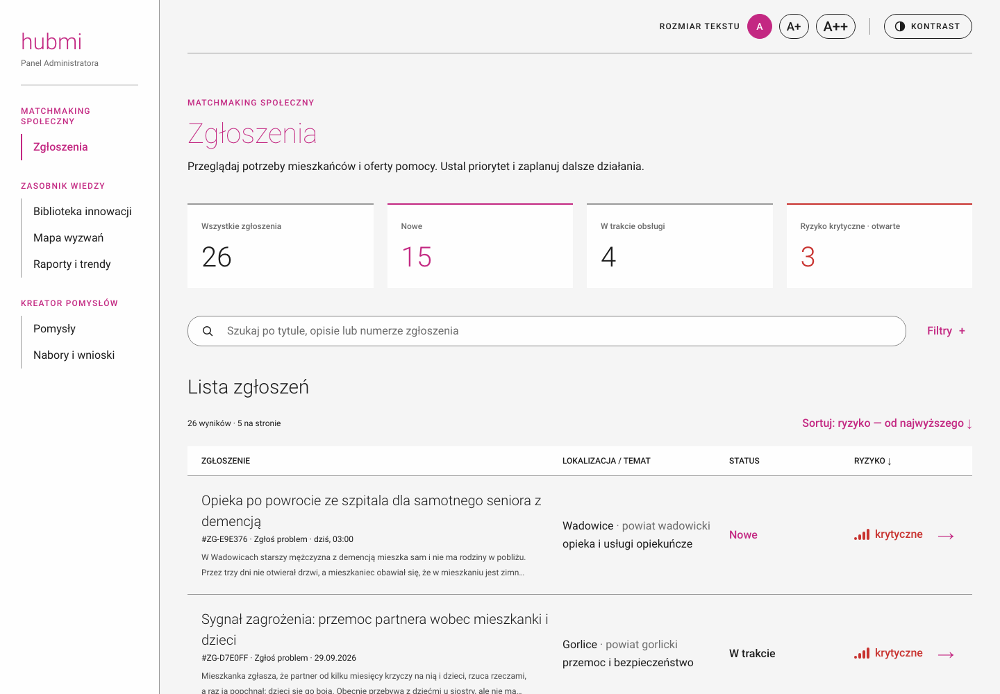 | 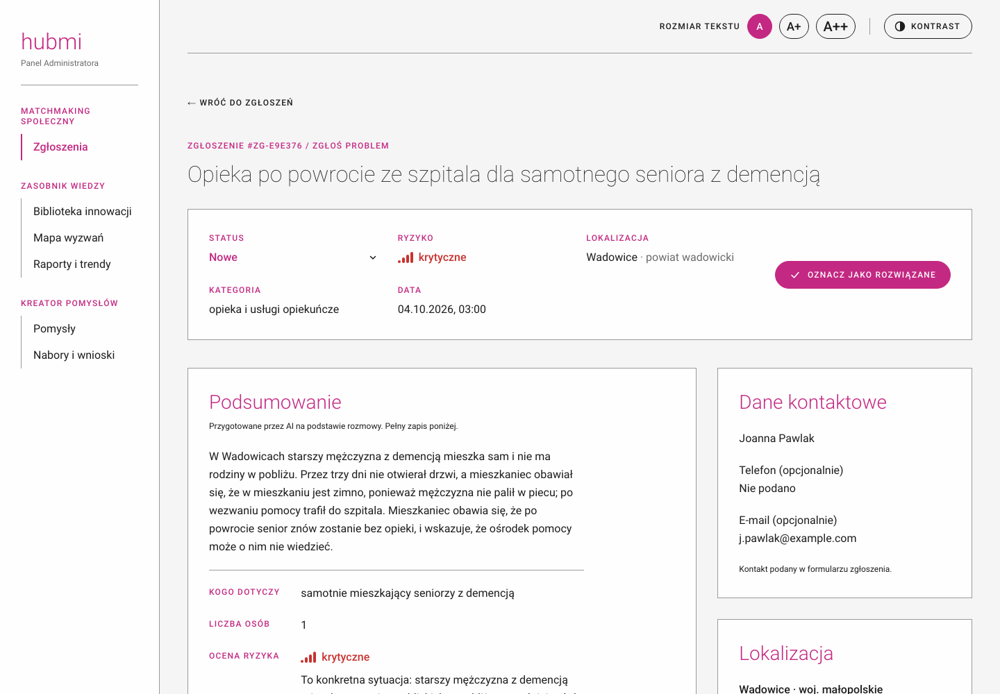 |
| **Zgłoszenia**: liczniki, wyszukiwarka, filtry i sortowanie po ryzyku. | **Szczegóły zgłoszenia**: podsumowanie AI, status, ryzyko z uzasadnieniem, mapa i dopasowane innowacje. |
| 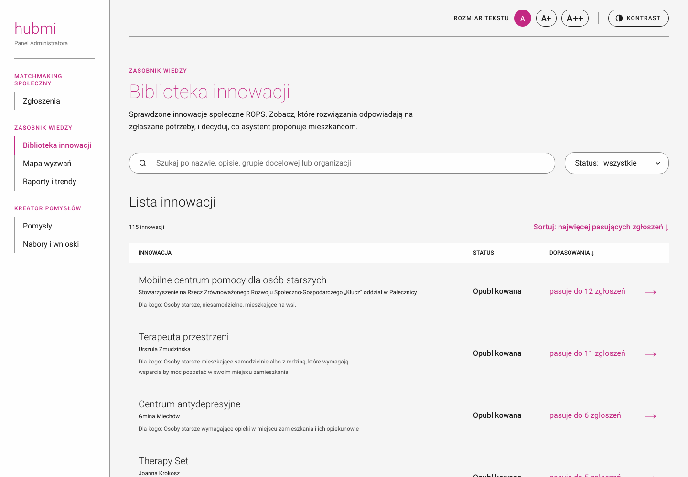 | 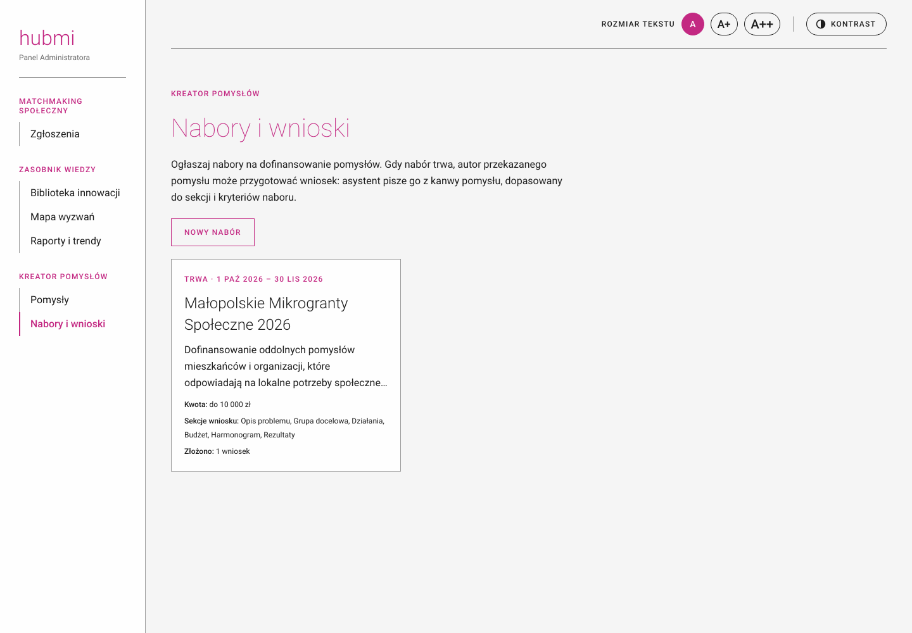 |
| **Biblioteka innowacji**: 115 innowacji ROPS, publikowanie i wycofywanie, liczba dopasowań. Pomysły mieszkańców mają osobną stronę. | **Nabory i wnioski**: ogłaszanie naborów na dofinansowanie i przegląd złożonych wniosków. |
| 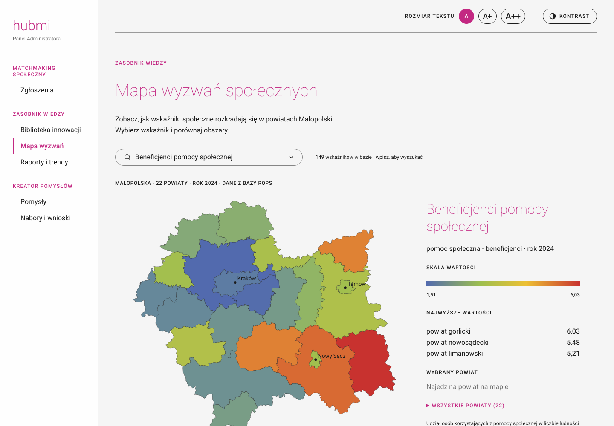 | 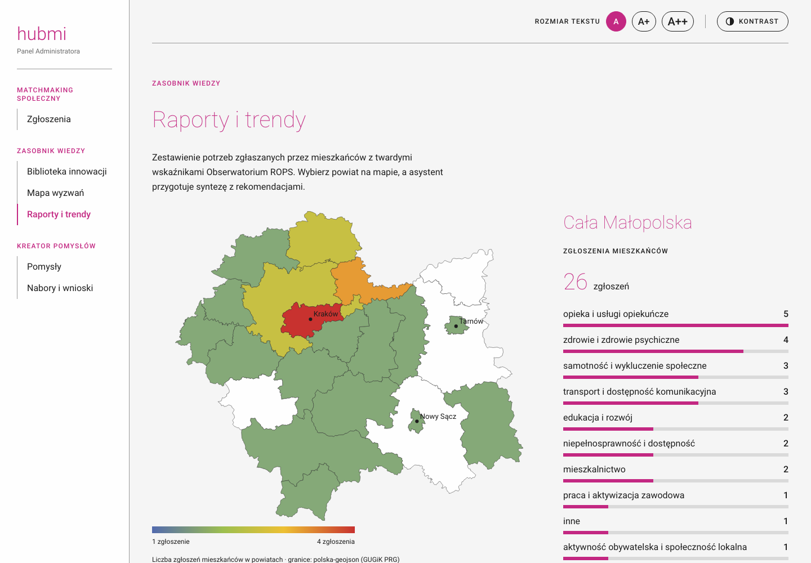 |
| **Mapa wyzwań**: 149 wskaźników Obserwatorium ROPS w 22 powiatach Małopolski. | **Raporty i trendy**: zgłoszenia mieszkańców na tle wskaźników i synteza AI dla wybranego powiatu. |

## Stack

Next.js 16 (App Router) · React 19 · TypeScript · Tailwind CSS v4 · Motion · Drizzle ORM ·
PostgreSQL + pgvector · OpenAI (Responses API, `text-embedding-3-small`) · Zod · OpenStreetMap +
Nominatim (mapa lokalizacji, bez klucza API).

## Struktura

```text
app/                     trasy (UI po polsku)
  zglos-problem/         czat „Zgłoś problem”
  zaoferuj-pomoc/        czat „Zaoferuj pomoc” → kanwa/ → wniosek/
  innowacje/[id]/        publiczna strona innowacji
  admin/                 Panel Administratora: zgloszenia, inicjatywy (+ pomysly), nabory, mapa-potrzeb, raporty
  api/                   cienkie route handlers: walidacja zod → lib/server
lib/server/              dostęp do danych, AI (czat, RAG, enrichment, raporty), matchmaking
server/db/               schemat Drizzle, migracje, seed
shared/components/       komponenty współdzielone (czat, belka dostępności, markdown, animacje)
docs/                    opis kreatora pomysłów, zrzuty ekranu
```

Szczegółowy przebieg ścieżki „Zaoferuj pomoc” (fiszka → kanwa → przekazanie → wniosek) opisuje
[`docs/kreator-pomyslow.md`](docs/kreator-pomyslow.md).

## Zespół

- Piotr_Wittig[**Schoji**]
- Karol_Wroński[**karol-wronski-dev**]
- Mikołaj_Mołodecki[**MiniowaPM**]
- Paweł_Dutkiewicz[**DudeQ7**]
- Scarlet_Dorożalska[**MasterSun8**]
- Aleksy_Chojnowski[**ZekqKeku**]

